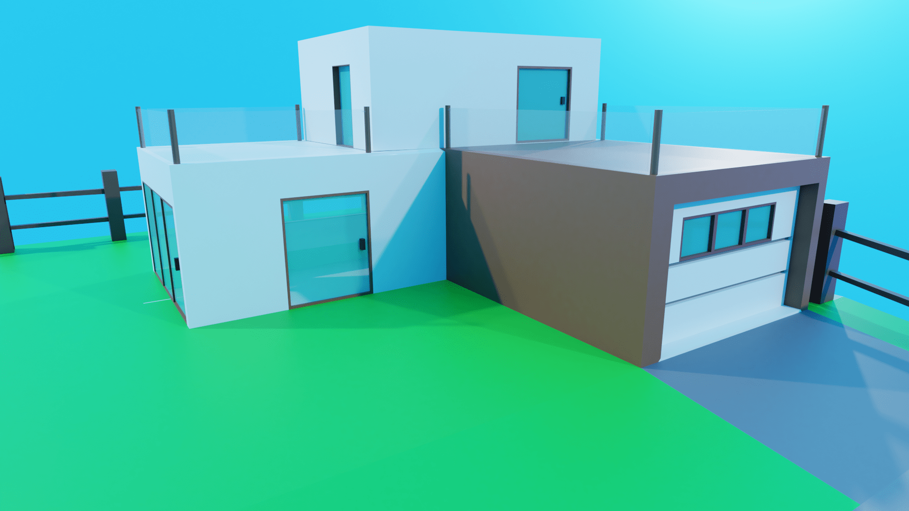

import { T } from "../../../src/components/Markdown"

# 18 Months. A Journey

So, Hello There. This essay, i guess you could call it, is my small little blog on my journey in blender through 18 months of my life. All of it started in March of 2020. Lockdown just happened and on the youtube recommendations, i catched this video

<iframe width="560" height="315" src="https://www.youtube.com/embed/y7PdiGXbrD0" title="YouTube video player" frameborder="0" allow="accelerometer; autoplay; clipboard-write; encrypted-media; gyroscope; picture-in-picture" allowfullscreen></iframe>

I was immediately intrigued. Never heard of blender before, and the entire process looked like my physics textbook. But i knew i had to try it out. 

So i did the obvious and googled blender tutorials. First one that came up was the Blender Guru Donut tutorial. I never really completed the tutorial 😅. Only ever did the donut, so about Level 2 into the tutorial. It took me like 3 weeks, and I rendered it out. Now I would love to show you guys what I made but sadly, its been lost to time. Rendering it out and seeing the final result made me super happy.....but my 2012 Macbook pro wanted to cry. And ofcourse, I was naive and decided that rendering at 32k samples was a good idea. And I was an even bigger idiot because I let it render out over 3 days straight. I am not exaggerating. 

Most of my very early work has been lost to time, but after some time, I learnt a few things and did this render with the very same donut

As you can see..... I did not know how to tile. And that checkered pattern was made by hand...... well we all learn from our inadequacies I suppose. 

After that, I saw the youtuber [daniell krafft](https://www.youtube.com/channel/UCojEXrCBzO-cP2N5YlRcrWw) making icons in 3d, and immediately knew I had to try it. And this is the end result

It was BAD, the texture didn't even line up, and neither did i try to. 

At this point, I left blender for a while, about a month or so to do programming. Soon though, my uncle came to visit. I usually had something to show him, but not this time. But, since he was an architect, I decided to surprise him with this

I still think this is a pretty good render, although the lighting could have been better, and the house is pretty tiny.

At around this point my friends had managed to make me watch star wars, and because of that, i wanted to make a spaceship. And i did.

Still super proud of this to this day. i wish i had the .blend file for it. Would have loved to animate this.

After this came another small 2 week break. I came across an [imphenzia's tutorial on creating a car in 10 minutes.](https://www.youtube.com/watch?v=YALV3HqfdLY&t=9s) And thats the start of my car journey.

I then proceeded to follow a tutorial from him of making a car game with blender and unity, which was very fun. 

Soon enough, he posted the video that started my favourite hobby 

<iframe width="560" height="315" src="https://www.youtube.com/embed/5cM_lhRmiQI" title="YouTube video player" frameborder="0" allow="accelerometer; autoplay; clipboard-write; encrypted-media; gyroscope; picture-in-picture" allowfullscreen></iframe>

This holds up suprisingly. 

Next, i decided to do something thats not too curvy, and landed on an f40

I was inpired by some people of the Daniell Krafft Discord Server and decided to make my own widebody for the F40. Also because I wanted to piss some purists off.

as you can see by the reflections, my topology was subpar to say the least.

Feeling bold, I decided to do a lamborghini aventador

That was a huge mistake. Im sorry you have to see this. Remember kids, dont make a Lamborghini after 2 cars thinking that its a good idea.

I made myself feel better with a Evo X and a dodge hellcat, neither of which is worthy of a mention. 

next up is my gallardo, which I was proud of for the amount of detail I put into it, and even present me is surprised as to the amount of detail here. 

I then bombarded with a host of modifications

an offroader, 

and a widebody stance boi

I then put them ride by side for an epic scene

I was having a conversation with my friends about our future and we were talking about our dream houses, proceeding which I hopped onto blender to create my dream house

a tiny house with a driveway and a huge garage big enough for 4 cars, because im a car guy if you could not tell already

Around this time, Cyberpunk 2077 got its teaser trailers, for which i was hyped (oh poor, innocent past me)

For which i made a cyberpunk gallardo. It looks bad but im still proud of it. 

Next up is my favourite low poly car I will ever make. Because ive told myself i wont make any more low poly cars. Presenting to you, my aston martin vantage, and its different versions

particularly fond of the safety car version

For a competition in the Daniell Krafft discord server, which was themed "retro future", I decided to do this render 

It was my first proper time adding volumetrics and so proud of this

Then, while deciding to make a low poly amg gtr, I said "screw it"

and made my first high poly car. I did not know how to panel properly or the shrinkwrap technique (what i use for modelling all my cars now). It looks pretty bad, but im still proud of it. It was my start. Oh and btw, I dont make any rims or tires on this model, or any high poly car till date. This was also on the macbook pro which wanted to die at this point.

I decided to give it a rest and do some abstract art. The best of which you can see here

I decided to push my laptop for another competition, and have my try at photorealism

This....was bad. The mouse and keyboard look extremely good, but the rest are all meh. The iMac has flipped normals everywhere and its decent enough to pass, but not good enough. The pant leaves are also completely opaque.

I made a rx7 too but it itself isnt that notewothy, however the scenery that my friend [Drac](https://www.instagram.com/dracthedino/) did, is.

He had a considerably better laptop than me at the time....***but not for much longer***

I got a new laptop (in case you're interested in the specs, it has a r5 4600h and a rx5600m) and decided to create two cars which were really meh to be honest. 

But then, for a scene I shall show later, my rx7 was not good enough, it NEEDED to be better. So, I decided I was going to remake the rx7, **but much better**

And thus was born my wallpaper worthy RX7 FD3S Rocket bunny render. 

Now the scene for which i needed it was this one. 

It was my first time creating a proper scene and with rain. So I added some rain particles, added some procedural rain droplets, made the ground procedurally wet and made this render which I am proud of. The nissan GTR you can see there was not explicitely mentioned, because it was very average.

The next two cars are ones im very proud of too

A 1974 Porche 911 Turbo

And a remake of my low poly vantage, into higher pollies

There isn't a very special story behind these, but the end result looks great in my eyes. Especially with that Aston Martin. 

And that's about it for now. You just read through 18 months of my Journey into blender, and I hope you enjoyed. 

If I inspired you to start your own blender journey, I couldn't be any happier