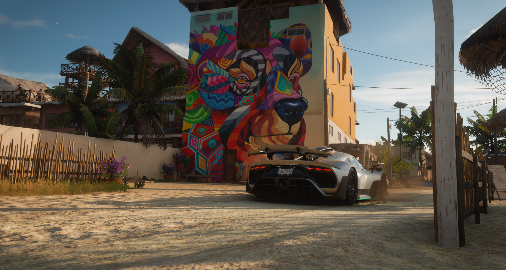

# Forza and Music

Driving in forza and listening to my liked songs on Spotify made me realise something....okay I was about to say profound but that would be wrong. Lets just call it interesting. 

before that though, I want to clear some things for the people that might not be familiar with what this is. Forza is a racing franchise comprising of two game series. Motorsport and Horizon. I will be talking about Horizon, specifically the fifth installment, called Forza horizon 5. It takes place in Mexico and is absolutely beautiful. Here's a picture btw of how it can look. 

Forza comes with inbuilt radio, 6 in fact, with over a 100 tracks to listen to (and also drive!), but I don't use it. I listen to my liked songs in Spotify in the background. I have seen a strange phenomena happening. Music affects my driving. Some songs make me drive better, some songs make me drive slower, and some songs make me look like I am touching the game for the first time, when I in fact have over 30 hours into this title in 1 week. I am definitely not addicted, I swear. 

However, I have noticed that some songs make me completely switch driving, Which is weird. 

A song like [Destiny](https://open.spotify.com/track/0oW5yI88PqLgQXGY60E4ea?si=9b86b0752ad14158) will make me want to take my AMG project one and zoom past everybody on the highway at top speed. [I just want to be somebody to someone](https://open.spotify.com/track/3cb4TWzTFJGVYX9FHyl8uq?si=02fb7dacdfca4d16) makes me want to take a slow rally car and go cross country. A song like [blame it on the kids](https://open.spotify.com/track/6bsGUcHX3dlouSNvMYH8Pk?si=cf35598e6c8e43f6) makes me want to take my fastest rally car and fly across the map without a care in the world. And because of this, I have come to associate these songs to different feelings too. If I am sitting at home, doing nothing, listening to music, and destiny comes up? I immediately want to drive on the highway. 

To be honest I don't know what the point was of this blog post, I just wanted to share my findings on this. I hope atleast 1 person found this useful lol. This blog is a place for me to just write. So if you are reading this and feel like I am spitting utter nonsense, please bear with me 😅